# 🚀 AuditAI V3.0 Upgrade Roadmap

> **From V2.5 → V3.0 (Phase 9.1 → 9.2 → 9.3)**  
> Author: Senior Mentor | Date: 2026-02-02  
> Target Audience: AI Engineering learner building production-grade agent systems

---

## 📋 Mục Lục

1. [Tổng Quan Chiến Lược](#1-tổng-quan-chiến-lược)
2. [Folder Structure Proposal](#2-folder-structure-proposal)
3. [Config-Based Version Routing](#3-config-based-version-routing)
4. [Phase 9.1: Reasoning Foundation](#4-phase-91-reasoning-foundation)
5. [Phase 9.2: Agentic Orchestration](#5-phase-92-agentic-orchestration)
6. [Phase 9.3: Production Hardening](#6-phase-93-production-hardening)
7. [Atomic Task Checklist](#7-atomic-task-checklist)
8. [Appendix: Interface Contracts](#8-appendix-interface-contracts)

---

## 1. Tổng Quan Chiến Lược

### Nguyên Tắc Quan Trọng

| Principle | Implementation |
|-----------|----------------|
| **No Breaking Changes** | Code V2.5 giữ nguyên, V3 là layer mới |
| **Interface-First** | Mọi component mới đều có interface trong `Application` |
| **Config-Driven** | `appsettings.json` quyết định version nào được activate |
| **Layered Evolution** | V1 → V2.5 → V3.0 → V3.1 có thể switch bất kỳ lúc nào |

### Version Matrix

```
┌─────────────────────────────────────────────────────────────────────┐
│ AuditAI:Version    │ Active Services                               │
├────────────────────┼───────────────────────────────────────────────┤
│ "V1"               │ LogKnowledgeService (Static RAG)              │
│ "V2.5"             │ AgenticAuditService (Drain3 + Weighted)       │
│ "V3.0-Phase1"      │ + SemanticLogParser + HybridRAG               │
│ "V3.0-Phase2"      │ + ReflexionAgent + StateGraph                 │
│ "V3.0"             │ Full V3 (Production Ready)                    │
└────────────────────┴───────────────────────────────────────────────┘
```

---

## 2. Folder Structure Proposal

### Application Layer (Interfaces + DTOs)

```
ControlHub.Application/
├── Common/
│   └── Interfaces/
│       └── AI/
│           ├── V1/                          # [EXISTING] Keep as-is
│           │   └── ILogKnowledgeService.cs
│           │
│           ├── V25/                         # [EXISTING] Rename for clarity
│           │   ├── IAuditAgentService.cs
│           │   ├── ILogParserService.cs
│           │   ├── ISamplingStrategy.cs
│           │   └── IRunbookService.cs
│           │
│           └── V3/                          # [NEW] Phase 9.1-9.3
│               ├── Parsing/
│               │   ├── ISemanticLogClassifier.cs    # 9.1
│               │   └── IHybridLogParser.cs          # 9.1
│               │
│               ├── Retrieval/
│               │   ├── IReranker.cs                 # 9.1
│               │   ├── IMultiHopRetriever.cs        # 9.1
│               │   └── IAgenticRAG.cs               # 9.2
│               │
│               ├── Reasoning/
│               │   ├── IReasoningModel.cs           # 9.1
│               │   └── IConfidenceScorer.cs         # 9.1
│               │
│               ├── Agents/
│               │   ├── IAgentState.cs               # 9.2
│               │   ├── IAgentNode.cs                # 9.2
│               │   ├── IStateGraph.cs               # 9.2
│               │   ├── IReflexionLoop.cs            # 9.2
│               │   └── IToolRegistry.cs             # 9.2
│               │
│               └── Orchestration/
│                   ├── IAuditAgentV3.cs             # 9.2 Main Entry
│                   └── IAgentObserver.cs            # 9.3 Telemetry
│
└── AI/
    ├── V1/                                  # [EXISTING]
    │   └── LogKnowledgeService.cs
    │
    ├── V25/                                 # [EXISTING] Refactor path
    │   ├── AgenticAuditService.cs
    │   └── RunbookService.cs
    │
    └── V3/                                  # [NEW]
        ├── Agents/
        │   ├── AuditAgentV3.cs              # Main orchestrator
        │   ├── AgentState.cs                # State machine state
        │   └── Nodes/
        │       ├── PlannerNode.cs
        │       ├── ExecutorNode.cs
        │       ├── VerifierNode.cs
        │       └── ReflectorNode.cs
        │
        ├── Parsing/
        │   └── HybridLogParser.cs           # Drain3 + Semantic
        │
        ├── Retrieval/
        │   ├── AgenticRAGService.cs
        │   └── CrossEncoderReranker.cs
        │
        └── Reasoning/
            └── ReasoningModelAdapter.cs
```

### Infrastructure Layer (Implementations)

```
ControlHub.Infrastructure/
└── AI/
    ├── V1/                                  # [EXISTING - Keep]
    │
    ├── V25/                                 # [EXISTING - Keep]
    │   ├── Parsing/
    │   │   └── Drain3ParserService.cs
    │   └── Strategies/
    │       ├── NaiveSamplingStrategy.cs
    │       └── WeightedReservoirSamplingStrategy.cs
    │
    └── V3/                                  # [NEW]
        ├── ML/
        │   ├── OnnxLogClassifier.cs         # ONNX Runtime for BERT
        │   └── OnnxReranker.cs              # Cross-Encoder
        │
        ├── Embeddings/
        │   └── SentenceTransformerService.cs  # Better embedding model
        │
        ├── LLM/
        │   ├── ReasoningModelClient.cs      # o1/DeepSeek-R1 adapter
        │   └── LocalLLMWithCoT.cs           # Ollama + forced CoT
        │
        └── Observability/
            ├── AgentTracer.cs               # OpenTelemetry integration
            └── ThoughtLogger.cs             # Log agent reasoning
```

---

## 3. Config-Based Version Routing

### appsettings.json Schema (V3)

```json
{
  "AuditAI": {
    "Version": "V3.0",
    
    "V3": {
      "Parsing": {
        "Mode": "Hybrid",
        "SemanticClassifierModel": "distilbert-log-classifier",
        "OnnxModelPath": "./Models/log_classifier.onnx",
        "FallbackToDrain3": true
      },
      
      "Retrieval": {
        "Mode": "Agentic",
        "RerankerEnabled": true,
        "RerankerModel": "cross-encoder/ms-marco-MiniLM-L-6-v2",
        "MaxHops": 3,
        "TopK": 5
      },
      
      "Reasoning": {
        "Provider": "Ollama",
        "Model": "deepseek-r1:14b",
        "EnableCoT": true,
        "MaxRetries": 3,
        "Temperature": 0.1
      },
      
      "Agent": {
        "Mode": "Reflexion",
        "MaxReflectionCycles": 3,
        "EnableSelfCorrection": true,
        "TraceEnabled": true
      }
    }
  }
}
```

### DI Registration Pattern (ControlHubExtensions.cs)

```csharp
// Add after line 206 in ControlHubExtensions.cs
var aiVersion = configuration["AuditAI:Version"] ?? "V1";

switch (aiVersion)
{
    case "V3.0":
    case "V3.0-Phase2":
        // Full V3 Agent
        services.AddScoped<IAuditAgentV3, AuditAgentV3>();
        services.AddScoped<IStateGraph, StateGraph>();
        services.AddScoped<IReflexionLoop, ReflexionLoop>();
        services.AddScoped<IToolRegistry, ToolRegistry>();
        
        // Agent Nodes
        services.AddScoped<IAgentNode, PlannerNode>();
        services.AddScoped<IAgentNode, ExecutorNode>();
        services.AddScoped<IAgentNode, VerifierNode>();
        services.AddScoped<IAgentNode, ReflectorNode>();
        
        goto case "V3.0-Phase1"; // Fall-through
        
    case "V3.0-Phase1":
        // Semantic Parsing
        services.AddScoped<ISemanticLogClassifier, OnnxLogClassifier>();
        services.AddScoped<IHybridLogParser, HybridLogParser>();
        
        // Enhanced RAG
        services.AddScoped<IReranker, OnnxReranker>();
        services.AddScoped<IMultiHopRetriever, MultiHopRetriever>();
        services.AddScoped<IAgenticRAG, AgenticRAGService>();
        
        // Reasoning
        services.AddScoped<IReasoningModel, ReasoningModelClient>();
        services.AddScoped<IConfidenceScorer, ConfidenceScorer>();
        
        goto case "V2.5"; // Also register V2.5 as fallback
        
    case "V2.5":
        services.AddScoped<IAuditAgentService, AgenticAuditService>();
        break;
}

// Always register V1 for backward compatibility
services.AddScoped<ILogKnowledgeService, LogKnowledgeService>();
```

---

## 4. Phase 9.1: Reasoning Foundation

> **Mục tiêu:** Nâng cấp data quality và thêm reasoning capability

### 4.1 Hybrid Log Parsing

**Problem Solved:** Drain3 không nhận diện được log patterns mới (zero-day)

```
[Before - V2.5]
Raw Log: "User authentication failed: MFA timeout for user@corp.com"
Drain3 Output: "User authentication failed: MFA timeout for <EMAIL>"
→ Chỉ mask, không hiểu ngữ nghĩa

[After - V3.0]
Semantic Classifier: { category: "auth_failure", subcategory: "mfa", confidence: 0.94 }
→ Hiểu được ý nghĩa của log
```

**Architecture:**


**Key Interfaces:**

```csharp
// ISemanticLogClassifier.cs
public interface ISemanticLogClassifier
{
    Task<LogClassification> ClassifyAsync(string logLine);
    Task<float> GetConfidenceAsync(string logLine, string expectedCategory);
}

public record LogClassification(
    string Category,
    string SubCategory,
    float Confidence,
    Dictionary<string, string> ExtractedFields
);
```

### 4.2 Enhanced RAG with Reranking

**Problem Solved:** Vector search trả về kết quả "gần" nhưng không "đúng"

```
[Before - V2.5]
Query: "Database connection timeout after 30 seconds"
Top 3 Results:
  1. "Network timeout configuration" (score: 0.82) ← Wrong!
  2. "Database pool exhaustion" (score: 0.79) ← Right!
  3. "Connection string format" (score: 0.75) ← Wrong!

[After - V3.0 with Reranking]
After Cross-Encoder Rerank:
  1. "Database pool exhaustion" (score: 0.94) ← Moved up!
  2. "Network timeout configuration" (score: 0.45)
  3. "Connection string format" (score: 0.31)
```

**Key Interfaces:**

```csharp
// IReranker.cs
public interface IReranker
{
    Task<List<RankedDocument>> RerankAsync(
        string query, 
        List<Document> candidates, 
        int topK = 3
    );
}

// IMultiHopRetriever.cs
public interface IMultiHopRetriever
{
    Task<RetrievalResult> RetrieveAsync(
        string query,
        RetrievalOptions options
    );
}

public record RetrievalOptions(
    int MaxHops = 3,
    int TopKPerHop = 5,
    bool EnableReranking = true
);
```

### 4.3 Reasoning Model Integration

**Problem Solved:** LLM output không đáng tin cậy cho RCA

```csharp
// IReasoningModel.cs
public interface IReasoningModel
{
    Task<ReasoningResult> ReasonAsync(string prompt, ReasoningOptions options);
}

public record ReasoningResult(
    string Answer,
    string ChainOfThought,      // Visible reasoning steps
    float ConfidenceScore,
    List<string> Citations      // Evidence from context
);

public record ReasoningOptions(
    bool ForceChainOfThought = true,
    int MaxThinkingTokens = 1000,
    float Temperature = 0.1f
);
```

---

## 5. Phase 9.2: Agentic Orchestration

> **Mục tiêu:** Xây dựng Agent có khả năng tự sửa lỗi

### 5.1 State Machine Architecture

```mermaid
stateDiagram-v2
    [*] --> Planner
    Planner --> Executor: Plan Created
    Executor --> Verifier: Execution Done
    Verifier --> [*]: Verified ✓
    Verifier --> Reflector: Verification Failed
    Reflector --> Planner: Retry with Insights
    Reflector --> [*]: Max Retries Exceeded
```



**Key Interfaces:**

```csharp
// IAgentState.cs
public interface IAgentState
{
    string CurrentNode { get; set; }
    Dictionary<string, object> Memory { get; }
    List<ThoughtStep> Thoughts { get; }
    int RetryCount { get; set; }
    bool IsTerminal { get; }
}

public record ThoughtStep(
    string Node,
    string Action,
    string Observation,
    DateTime Timestamp
);

// IAgentNode.cs
public interface IAgentNode
{
    string Name { get; }
    Task<IAgentState> ExecuteAsync(IAgentState state, CancellationToken ct);
    string NextNode(IAgentState state); // Edge logic
}

// IStateGraph.cs
public interface IStateGraph
{
    void AddNode(IAgentNode node);
    void AddEdge(string from, string to, Func<IAgentState, bool> condition);
    Task<IAgentState> RunAsync(IAgentState initialState, CancellationToken ct);
}
```

### 5.2 Reflexion Loop

```csharp
// IReflexionLoop.cs
public interface IReflexionLoop
{
    Task<ReflexionResult> ExecuteAsync(
        Func<IAgentState, Task<string>> generator,
        Func<string, Task<CriticResult>> critic,
        IAgentState state,
        int maxAttempts = 3
    );
}

public record CriticResult(
    bool IsAcceptable,
    string Feedback,
    List<string> ViolatedRules
);

public record ReflexionResult(
    string FinalOutput,
    int AttemptsUsed,
    List<ReflexionAttempt> History
);
```

### 5.3 Dynamic Tool Registry

```csharp
// IToolRegistry.cs
public interface IToolRegistry
{
    void Register<T>(string name, Func<T, Task<object>> handler);
    Task<object> InvokeAsync(string toolName, object args);
    List<ToolDescription> GetAvailableTools();
}

public record ToolDescription(
    string Name,
    string Description,
    JsonSchema InputSchema
);
```

---

## 6. Phase 9.3: Production Hardening

> **Mục tiêu:** Observability, Testing, và Deployment readiness

### 6.1 Agent Observability

```csharp
// IAgentObserver.cs
public interface IAgentObserver
{
    void OnNodeEnter(string nodeName, IAgentState state);
    void OnNodeExit(string nodeName, IAgentState state, TimeSpan duration);
    void OnToolCall(string toolName, object args, object result);
    void OnReflection(int attempt, CriticResult feedback);
    void OnComplete(IAgentState finalState);
}
```

**Telemetry Output:**

```json
{
  "traceId": "abc-123",
  "agentRun": {
    "startTime": "2026-02-02T10:00:00Z",
    "endTime": "2026-02-02T10:00:05Z",
    "totalDuration": "5.2s",
    "nodes": [
      { "name": "Planner", "duration": "1.2s", "output": "Plan: [1, 2, 3]" },
      { "name": "Executor", "duration": "2.5s", "toolsCalled": ["Drain3Parser", "RunbookLookup"] },
      { "name": "Verifier", "duration": "0.8s", "result": "PASS" }
    ],
    "reflexionAttempts": 1,
    "finalConfidence": 0.87
  }
}
```

### 6.2 Testing Strategy

| Test Type | Target | Tool |
|-----------|--------|------|
| Unit Test | Individual Nodes | xUnit + Moq |
| Integration Test | Full Agent Flow | WebApplicationFactory |
| Regression Test | V2.5 vs V3.0 output comparison | Custom harness |
| Load Test | Token throughput | k6 / Artillery |

---

## 7. Atomic Task Checklist

### Phase 9.1: Reasoning Foundation (Est. 3-4 weeks)

#### Week 1-2: Semantic Log Parsing

- [ ] **9.1.1** Tạo folder structure `Application/Common/Interfaces/AI/V3/`
- [ ] **9.1.2** Define `ISemanticLogClassifier` interface
- [ ] **9.1.3** Define `IHybridLogParser` interface
- [ ] **9.1.4** Download/export DistilBERT ONNX model cho log classification
- [ ] **9.1.5** Implement `OnnxLogClassifier` trong Infrastructure
- [ ] **9.1.6** Implement `HybridLogParser` (Drain3 + Semantic routing)
- [ ] **9.1.7** Unit test: `HybridLogParser` với mixed log samples
- [ ] **9.1.8** Update `appsettings.json` với V3 Parsing config
- [ ] **9.1.9** Register DI cho Phase1 services trong `ControlHubExtensions.cs`

#### Week 2-3: Enhanced RAG

- [ ] **9.1.10** Define `IReranker` interface
- [ ] **9.1.11** Define `IMultiHopRetriever` interface
- [ ] **9.1.12** Download Cross-Encoder ONNX model
- [ ] **9.1.13** Implement `OnnxReranker`
- [ ] **9.1.14** Implement `MultiHopRetriever` (iterative query refinement)
- [ ] **9.1.15** Define `IAgenticRAG` interface
- [ ] **9.1.16** Implement `AgenticRAGService` (combine retriever + reranker)
- [ ] **9.1.17** Unit test: Reranking với known-good/bad documents
- [ ] **9.1.18** Integration test: Full RAG pipeline

#### Week 3-4: Reasoning Integration

- [ ] **9.1.19** Define `IReasoningModel` interface
- [ ] **9.1.20** Define `IConfidenceScorer` interface
- [ ] **9.1.21** Implement `ReasoningModelClient` (Ollama with CoT prompting)
- [ ] **9.1.22** Implement `ConfidenceScorer` (extract confidence from output)
- [ ] **9.1.23** Update `AgenticAuditService` to use new reasoning (optional flag)
- [ ] **9.1.24** Evaluation: Compare RCA accuracy V2.5 vs V3.0-Phase1

---

### Phase 9.2: Agentic Orchestration (Est. 3-4 weeks)

#### Week 5: State Machine Foundation

- [ ] **9.2.1** Define `IAgentState` interface
- [ ] **9.2.2** Implement `AgentState` class
- [ ] **9.2.3** Define `IAgentNode` interface
- [ ] **9.2.4** Define `IStateGraph` interface
- [ ] **9.2.5** Implement `StateGraph` (node + edge management)
- [ ] **9.2.6** Unit test: Simple 3-node graph execution

#### Week 6: Core Agent Nodes

- [ ] **9.2.7** Implement `PlannerNode` (phân tích input, tạo execution plan)
- [ ] **9.2.8** Implement `ExecutorNode` (thực thi tool calls)
- [ ] **9.2.9** Implement `VerifierNode` (kiểm tra output quality)
- [ ] **9.2.10** Unit test: Each node independently
- [ ] **9.2.11** Integration test: Planner → Executor → Verifier flow

#### Week 7: Reflexion Loop

- [ ] **9.2.12** Define `IReflexionLoop` interface
- [ ] **9.2.13** Implement `ReflectorNode` (analyze failures, suggest retry)
- [ ] **9.2.14** Implement `ReflexionLoop` orchestrator
- [ ] **9.2.15** Add reflexion edges to StateGraph
- [ ] **9.2.16** Unit test: Reflexion with mocked critic
- [ ] **9.2.17** Integration test: Full loop with intentional failure

#### Week 8: Tool Registry & Main Agent

- [ ] **9.2.18** Define `IToolRegistry` interface
- [ ] **9.2.19** Implement `ToolRegistry` (dynamic tool registration)
- [ ] **9.2.20** Register existing tools: Drain3Parser, RunbookLookup, etc.
- [ ] **9.2.21** Define `IAuditAgentV3` interface
- [ ] **9.2.22** Implement `AuditAgentV3` (main entry point)
- [ ] **9.2.23** Wire up DI for V3.0-Phase2
- [ ] **9.2.24** End-to-end test: Full agent run

---

### Phase 9.3: Production Hardening (Est. 2-3 weeks)

#### Week 9: Observability

- [ ] **9.3.1** Define `IAgentObserver` interface
- [ ] **9.3.2** Implement `AgentTracer` (OpenTelemetry spans)
- [ ] **9.3.3** Implement `ThoughtLogger` (log chain of thought)
- [ ] **9.3.4** Add observer hooks to StateGraph
- [ ] **9.3.5** Create dashboard view for agent traces

#### Week 10: Error Handling & Fallback

- [ ] **9.3.6** Implement graceful degradation (V3 → V2.5 → V1 fallback)
- [ ] **9.3.7** Add circuit breaker for ONNX model failures
- [ ] **9.3.8** Add timeout handling for long-running nodes
- [ ] **9.3.9** Implement agent run cancellation

#### Week 11: Testing & Documentation

- [ ] **9.3.10** Write regression test suite (V2.5 vs V3.0)
- [ ] **9.3.11** Performance benchmark (latency P50/P99)
- [ ] **9.3.12** Update API documentation (Swagger)
- [ ] **9.3.13** Create `AuditAI_V3_DeepDive.md` technical doc
- [ ] **9.3.14** Update `appsettings.Example.json` with V3 config

---

## 8. Appendix: Interface Contracts

### Full Interface Files (Copy-Paste Ready)

#### ISemanticLogClassifier.cs

```csharp
namespace ControlHub.Application.Common.Interfaces.AI.V3.Parsing;

public interface ISemanticLogClassifier
{
    /// <summary>
    /// Classifies a log line using semantic understanding.
    /// </summary>
    Task<LogClassification> ClassifyAsync(string logLine, CancellationToken ct = default);
    
    /// <summary>
    /// Returns confidence score for a specific category prediction.
    /// </summary>
    Task<float> GetConfidenceAsync(string logLine, string expectedCategory, CancellationToken ct = default);
}

public record LogClassification(
    string Category,
    string SubCategory,
    float Confidence,
    Dictionary<string, string> ExtractedFields
);
```

#### IAgentState.cs

```csharp
namespace ControlHub.Application.Common.Interfaces.AI.V3.Agents;

public interface IAgentState
{
    string SessionId { get; }
    string CurrentNode { get; set; }
    Dictionary<string, object> Memory { get; }
    List<ThoughtStep> Thoughts { get; }
    int RetryCount { get; set; }
    int MaxRetries { get; }
    bool IsTerminal { get; }
    
    void AddThought(string node, string action, string observation);
    T GetMemory<T>(string key, T defaultValue = default);
    void SetMemory<T>(string key, T value);
}

public record ThoughtStep(
    string Node,
    string Action,
    string Observation,
    DateTime Timestamp
);
```

#### IAuditAgentV3.cs

```csharp
namespace ControlHub.Application.Common.Interfaces.AI.V3.Orchestration;

public interface IAuditAgentV3
{
    /// <summary>
    /// Main entry point for V3 agent-based audit.
    /// </summary>
    Task<AgentAuditResult> InvestigateAsync(
        string correlationId, 
        string lang = "en",
        CancellationToken ct = default
    );
    
    /// <summary>
    /// Chat with agentic workflow.
    /// </summary>
    Task<AgentChatResult> ChatAsync(
        ChatRequest request,
        string lang = "en", 
        CancellationToken ct = default
    );
}

public record AgentAuditResult(
    string Analysis,
    List<LogTemplate> Templates,
    List<string> ToolsUsed,
    AgentTrace Trace,
    float ConfidenceScore
);

public record AgentTrace(
    string SessionId,
    List<ThoughtStep> Thoughts,
    int ReflexionAttempts,
    TimeSpan TotalDuration
);
```

---

## 📝 Ghi Chú Cuối

> **Tip cho AI Engineering Journey:**
> 
> - Mỗi interface em định nghĩa là một **learning opportunity**
> - ONNX Runtime cho phép chạy model ML mà không cần Python
> - Chain-of-Thought prompting là kỹ thuật prompt engineering quan trọng
> - Reflexion loop là pattern được dùng trong nhiều production agent systems
> 
> **Đừng ngại fail!** Agent systems luôn có bug lúc đầu. Đó là lý do có Verifier và Reflector nodes.

---

**End of Document**
