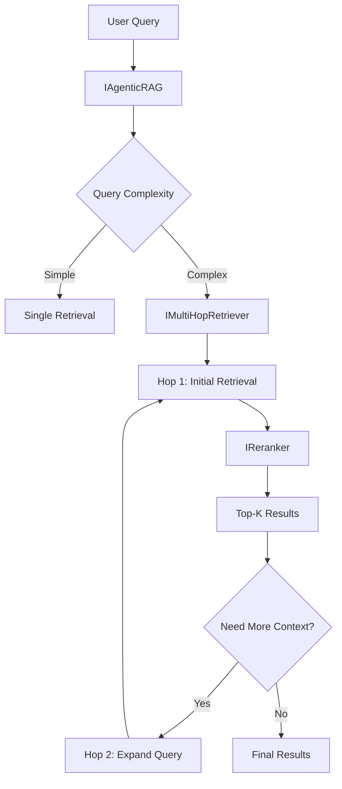

# Implementation Plan: Enhanced RAG (Week 2-3)

## Overview

Implementing **Tasks 9.1.10 through 9.1.18** to enhance the RAG (Retrieval-Augmented Generation) pipeline with:
- **Reranker**: Cross-encoder ONNX model for relevance scoring
- **Multi-hop Retriever**: Iterative retrieval for complex queries
- **Agentic RAG**: Autonomous retrieval orchestration

---

## Architecture Overview



---

## Tasks Breakdown

### 9.1.10 - Define `IReranker` Interface

**File**: `src/ControlHub.Application/Common/Interfaces/AI/V3/RAG/IReranker.cs`

```csharp
public interface IReranker
{
    Task<List<RankedDocument>> RerankAsync(
        string query, 
        List<RetrievedDocument> candidates, 
        int topK = 5,
        CancellationToken ct = default
    );
    
    Task<float> ScoreAsync(
        string query, 
        string document, 
        CancellationToken ct = default
    );
}

public record RankedDocument(
    string Content,
    float RelevanceScore,
    Dictionary<string, string> Metadata
);

public record RetrievedDocument(
    string Content,
    float InitialScore,
    Dictionary<string, string> Metadata
);
```

---

### 9.1.11 - Define `IMultiHopRetriever` Interface

**File**: `src/ControlHub.Application/Common/Interfaces/AI/V3/RAG/IMultiHopRetriever.cs`

```csharp
public interface IMultiHopRetriever
{
    Task<MultiHopResult> RetrieveAsync(
        string query,
        MultiHopOptions? options = null,
        CancellationToken ct = default
    );
}

public record MultiHopResult(
    List<RankedDocument> Documents,
    List<HopTrace> Traces,
    int TotalHops
);

public record HopTrace(
    int HopNumber,
    string ExpandedQuery,
    int CandidatesRetrieved,
    int CandidatesAfterRerank
);

public record MultiHopOptions(
    int MaxHops = 3,
    int CandidatesPerHop = 20,
    int TopKAfterRerank = 5,
    float ConfidenceThreshold = 0.7f
);
```

---

### 9.1.12 - Download Cross-Encoder ONNX Model

**Model**: `ms-marco-MiniLM-L-6-v2` (Cross-encoder for reranking)

**Steps**:
1. Download from Hugging Face: `cross-encoder/ms-marco-MiniLM-L-6-v2`
2. Convert to ONNX format (if needed)
3. Place in `src/ControlHub.API/Models/reranker.onnx`
4. Place vocab in `src/ControlHub.API/Models/reranker_vocab.txt`

**Configuration**:
```json
"AuditAI": {
  "V3": {
    "RerankerModelPath": "./Models/reranker.onnx",
    "RerankerVocabPath": "./Models/reranker_vocab.txt"
  }
}
```

---

### 9.1.13 - Implement `OnnxReranker`

**File**: `src/ControlHub.Infrastructure/AI/V3/RAG/OnnxReranker.cs`

**Key Points**:
- Use `FastBertTokenizer` for encoding query + document pairs
- ONNX inference for relevance scoring
- Singleton lifecycle (expensive ONNX session)

**Logic**:
```csharp
public async Task<List<RankedDocument>> RerankAsync(...)
{
    var scoredDocs = new List<(RetrievedDocument doc, float score)>();
    
    foreach (var doc in candidates)
    {
        var score = await ScoreAsync(query, doc.Content, ct);
        scoredDocs.Add((doc, score));
    }
    
    return scoredDocs
        .OrderByDescending(x => x.score)
        .Take(topK)
        .Select(x => new RankedDocument(
            x.doc.Content,
            x.score,
            x.doc.Metadata
        ))
        .ToList();
}
```

---

### 9.1.14 - Implement `MultiHopRetriever`

**File**: `src/ControlHub.Application/AI/V3/RAG/MultiHopRetriever.cs`

**Dependencies**:
- `IVectorDatabase` (existing)
- `IReranker` (new)
- `IEmbeddingService` (existing)

**Logic**:
```csharp
public async Task<MultiHopResult> RetrieveAsync(...)
{
    var allDocuments = new List<RankedDocument>();
    var traces = new List<HopTrace>();
    var currentQuery = query;
    
    for (int hop = 1; hop <= options.MaxHops; hop++)
    {
        // 1. Retrieve candidates
        var candidates = await _vectorDb.SearchAsync(currentQuery, options.CandidatesPerHop);
        
        // 2. Rerank
        var reranked = await _reranker.RerankAsync(currentQuery, candidates, options.TopKAfterRerank);
        
        // 3. Check if we have enough confidence
        if (reranked.First().RelevanceScore >= options.ConfidenceThreshold)
        {
            allDocuments.AddRange(reranked);
            traces.Add(new HopTrace(hop, currentQuery, candidates.Count, reranked.Count));
            break;
        }
        
        // 4. Expand query for next hop
        currentQuery = ExpandQuery(query, reranked);
        allDocuments.AddRange(reranked);
        traces.Add(new HopTrace(hop, currentQuery, candidates.Count, reranked.Count));
    }
    
    return new MultiHopResult(allDocuments, traces, traces.Count);
}
```

---

### 9.1.15 - Define `IAgenticRAG` Interface

**File**: `src/ControlHub.Application/Common/Interfaces/AI/V3/RAG/IAgenticRAG.cs`

```csharp
public interface IAgenticRAG
{
    Task<AgenticRAGResult> RetrieveAsync(
        string query,
        AgenticRAGOptions? options = null,
        CancellationToken ct = default
    );
}

public record AgenticRAGResult(
    List<RankedDocument> Documents,
    RAGStrategy StrategyUsed,
    Dictionary<string, object> Metadata
);

public enum RAGStrategy
{
    SingleHop,
    MultiHop,
    Hybrid
}

public record AgenticRAGOptions(
    bool EnableMultiHop = true,
    float ComplexityThreshold = 0.5f,
    int MaxDocuments = 10
);
```

---

### 9.1.16 - Implement `AgenticRAGService`

**File**: `src/ControlHub.Application/AI/V3/RAG/AgenticRAGService.cs`

**Decision Logic**:
```csharp
public async Task<AgenticRAGResult> RetrieveAsync(...)
{
    // 1. Analyze query complexity
    var complexity = AnalyzeQueryComplexity(query);
    
    // 2. Choose strategy
    if (complexity >= options.ComplexityThreshold && options.EnableMultiHop)
    {
        var result = await _multiHopRetriever.RetrieveAsync(query);
        return new AgenticRAGResult(
            result.Documents,
            RAGStrategy.MultiHop,
            new() { ["hops"] = result.TotalHops }
        );
    }
    else
    {
        // Single-hop with reranking
        var candidates = await _vectorDb.SearchAsync(query, 20);
        var reranked = await _reranker.RerankAsync(query, candidates, options.MaxDocuments);
        return new AgenticRAGResult(
            reranked,
            RAGStrategy.SingleHop,
            new() { ["candidates"] = candidates.Count }
        );
    }
}
```

---

### 9.1.17 - Unit Test: Reranking

**File**: `tests/ControlHub.Application.Tests/AI/V3/RAG/OnnxRerankerTests.cs`

**Test Cases**:
1. ✅ Rerank should order by relevance score
2. ✅ Top-K filtering works correctly
3. ✅ Score calculation returns valid range [0, 1]

---

### 9.1.18 - Integration Test: RAG Pipeline

**File**: `tests/ControlHub.Application.Tests/AI/V3/RAG/AgenticRAGIntegrationTests.cs`

**Test Cases**:
1. ✅ Simple query uses single-hop
2. ✅ Complex query triggers multi-hop
3. ✅ Multi-hop stops when confidence threshold met
4. ✅ End-to-end: Query → Retrieve → Rerank → Results

---

## DI Registration

**File**: `src/ControlHub.Infrastructure/Extensions/ControlHubExtensions.cs`

```csharp
if (aiVersion == "V3.0")
{
    // Existing
    services.AddSingleton<ISemanticLogClassifier, OnnxLogClassifier>();
    services.AddScoped<IHybridLogParser, HybridLogParser>();
    
    // NEW: RAG Components
    services.AddSingleton<IReranker, OnnxReranker>();
    services.AddScoped<IMultiHopRetriever, MultiHopRetriever>();
    services.AddScoped<IAgenticRAG, AgenticRAGService>();
    
    services.AddScoped<IAuditAgentService, AgenticAuditService>();
}
```

---

## Verification Plan

### Unit Tests
```bash
dotnet test --filter "AI.V3.RAG"
```

### Integration Tests
```bash
dotnet test --filter "AgenticRAGIntegrationTests"
```

### Manual Verification
1. Test simple query (e.g., "authentication error")
2. Test complex query (e.g., "why did user login fail after password reset?")
3. Verify multi-hop traces in logs

---

## Notes

> [!IMPORTANT]
> **Model Acquisition**: Task 9.1.12 requires downloading the cross-encoder model. This may take time depending on network speed.

> [!WARNING]
> **ONNX Session Lifecycle**: Both `OnnxLogClassifier` and `OnnxReranker` should be Singleton to avoid recreating expensive ONNX sessions.

> [!TIP]
> **Query Complexity Analysis**: For now, use simple heuristics (word count, question words). In Phase 9.2, this can be enhanced with LLM-based analysis.
