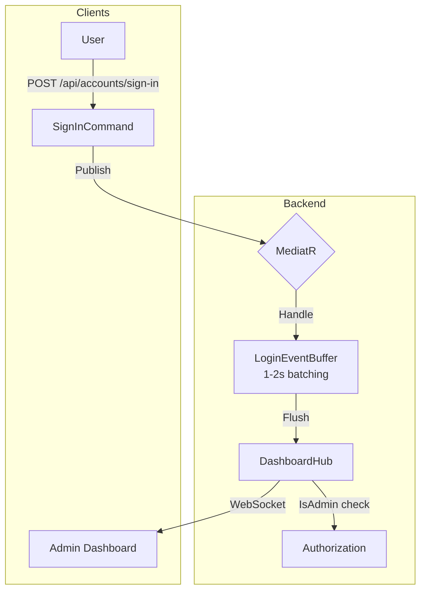

# Real-time Dashboard with SignalR - Implementation Plan (v2)

> [!NOTE]
> **Update v2**: Incorporated user feedback - Role-based auth, 1-2s batching, full frontend implementation, flexible interface design.

## 1. Overview

### What We Will Build
1. **Active Users Counter**: Real-time count of Admin/SupperAdmin online.
2. **Login Attempts Chart**: Batched updates (1-2s) showing login activity.

### Key Requirements
| # | Requirement | Implementation |
|---|-------------|----------------|
| 1 | Endpoint | `/hubs/dashboard` ✅ |
| 2 | Role Restriction | Admin + SupperAdmin only |
| 3 | Batching | 1-2s buffer using `System.Threading.Channels` |
| 4 | Frontend | Full implementation (hook + chart) |
| 5 | Scalability | Interface-based design (Redis-ready) |

---

## 2. Architecture



---

## 3. File Structure

```
src/
├── ControlHub.Application/
│   └── Common/Events/
│       └── LoginAttemptedEvent.cs              [NEW]
│
├── ControlHub.Infrastructure/
│   └── RealTime/
│       ├── Hubs/
│       │   └── DashboardHub.cs                 [NEW]
│       ├── Handlers/
│       │   └── DashboardNotificationHandler.cs [NEW]
│       └── Services/
│           ├── IActiveUserTracker.cs           [NEW] - Interface
│           ├── InMemoryActiveUserTracker.cs    [NEW] - Default impl
│           └── LoginEventBuffer.cs             [NEW] - Batching
│
├── ControlHub.API/
│   └── Program.cs                              [MODIFY]
│
└── ControlHub.UI/src/
    ├── hooks/
    │   └── use-realtime-stats.ts               [NEW]
    ├── components/dashboard/
    │   └── login-attempts-chart.tsx            [NEW]
    └── pages/
        └── dashboard-page.tsx                  [MODIFY]
```

---

## 4. Backend Implementation

### 4.1. Domain Event

**File**: `src/ControlHub.Application/Common/Events/LoginAttemptedEvent.cs`

```csharp
using MediatR;

namespace ControlHub.Application.Common.Events;

public record LoginAttemptedEvent : INotification
{
    public DateTimeOffset Timestamp { get; init; } = DateTimeOffset.UtcNow;
    public bool IsSuccess { get; init; }
    public string IdentifierType { get; init; } = string.Empty;
    public string MaskedIdentifier { get; init; } = string.Empty;
    public string? FailureReason { get; init; }
}
```

---

### 4.2. Active User Tracker (Interface-based for Redis-ready)

**File**: `src/ControlHub.Infrastructure/RealTime/Services/IActiveUserTracker.cs`

```csharp
namespace ControlHub.Infrastructure.RealTime.Services;

/// <summary>
/// Interface cho phép swap implementation (InMemory -> Redis) mà không đổi code.
/// </summary>
public interface IActiveUserTracker
{
    int GetActiveCount();
    int Increment();
    int Decrement();
}
```

**File**: `src/ControlHub.Infrastructure/RealTime/Services/InMemoryActiveUserTracker.cs`

```csharp
namespace ControlHub.Infrastructure.RealTime.Services;

/// <summary>
/// Default implementation - chạy trên single instance.
/// Để scale multi-instance: Tạo RedisActiveUserTracker implements IActiveUserTracker.
/// </summary>
public class InMemoryActiveUserTracker : IActiveUserTracker
{
    private int _count = 0;

    public int GetActiveCount() => _count;

    public int Increment() => Interlocked.Increment(ref _count);

    public int Decrement()
    {
        var newValue = Interlocked.Decrement(ref _count);
        if (newValue < 0)
        {
            Interlocked.Exchange(ref _count, 0);
            return 0;
        }
        return newValue;
    }
}
```

---

### 4.3. Login Event Buffer (Batching 1-2s)

**File**: `src/ControlHub.Infrastructure/RealTime/Services/LoginEventBuffer.cs`

```csharp
using System.Threading.Channels;
using ControlHub.Application.Common.Events;
using ControlHub.Infrastructure.RealTime.Hubs;
using Microsoft.AspNetCore.SignalR;
using Microsoft.Extensions.Hosting;
using Microsoft.Extensions.Logging;

namespace ControlHub.Infrastructure.RealTime.Services;

/// <summary>
/// Background service gom các LoginAttemptedEvent và gửi batch mỗi 1.5 giây.
/// Sử dụng System.Threading.Channels để thread-safe.
/// </summary>
public class LoginEventBuffer : BackgroundService
{
    private readonly Channel<LoginAttemptedEvent> _channel;
    private readonly IHubContext<DashboardHub> _hubContext;
    private readonly ILogger<LoginEventBuffer> _logger;
    private readonly TimeSpan _flushInterval = TimeSpan.FromMilliseconds(1500);

    public LoginEventBuffer(
        IHubContext<DashboardHub> hubContext,
        ILogger<LoginEventBuffer> logger)
    {
        _channel = Channel.CreateUnbounded<LoginAttemptedEvent>(new UnboundedChannelOptions
        {
            SingleReader = true,
            SingleWriter = false
        });
        _hubContext = hubContext;
        _logger = logger;
    }

    /// <summary>
    /// Được gọi từ DashboardNotificationHandler để thêm event vào buffer.
    /// </summary>
    public void Enqueue(LoginAttemptedEvent evt)
    {
        _channel.Writer.TryWrite(evt);
    }

    protected override async Task ExecuteAsync(CancellationToken stoppingToken)
    {
        var batch = new List<LoginAttemptedEvent>();

        while (!stoppingToken.IsCancellationRequested)
        {
            try
            {
                // Chờ có ít nhất 1 event hoặc timeout
                using var cts = CancellationTokenSource.CreateLinkedTokenSource(stoppingToken);
                cts.CancelAfter(_flushInterval);

                try
                {
                    while (await _channel.Reader.WaitToReadAsync(cts.Token))
                    {
                        while (_channel.Reader.TryRead(out var evt))
                        {
                            batch.Add(evt);
                        }
                    }
                }
                catch (OperationCanceledException)
                {
                    // Timeout - flush batch
                }

                if (batch.Count > 0)
                {
                    await FlushBatchAsync(batch, stoppingToken);
                    batch.Clear();
                }
            }
            catch (Exception ex)
            {
                _logger.LogError(ex, "Error in LoginEventBuffer");
            }
        }
    }

    private async Task FlushBatchAsync(List<LoginAttemptedEvent> batch, CancellationToken ct)
    {
        var payload = batch.Select(e => new
        {
            e.Timestamp,
            e.IsSuccess,
            e.IdentifierType,
            e.MaskedIdentifier,
            e.FailureReason
        }).ToArray();

        await _hubContext.Clients.All.SendAsync("LoginAttemptsBatch", payload, ct);
        _logger.LogDebug("Flushed {Count} login events to Dashboard", batch.Count);
    }
}
```

---

### 4.4. SignalR Hub (Role-based Authorization)

**File**: `src/ControlHub.Infrastructure/RealTime/Hubs/DashboardHub.cs`

```csharp
using ControlHub.Infrastructure.RealTime.Services;
using Microsoft.AspNetCore.Authorization;
using Microsoft.AspNetCore.SignalR;
using Microsoft.Extensions.Logging;

namespace ControlHub.Infrastructure.RealTime.Hubs;

/// <summary>
/// Hub cho Admin Dashboard.
/// CHỈ Admin hoặc SupperAdmin mới được connect.
/// </summary>
[Authorize(Policy = "DashboardAccess")]  // Sẽ tạo policy này
public class DashboardHub : Hub
{
    private readonly IActiveUserTracker _tracker;
    private readonly ILogger<DashboardHub> _logger;

    public DashboardHub(IActiveUserTracker tracker, ILogger<DashboardHub> logger)
    {
        _tracker = tracker;
        _logger = logger;
    }

    public override async Task OnConnectedAsync()
    {
        var count = _tracker.Increment();
        var userId = Context.User?.FindFirst("sub")?.Value ?? "Unknown";
        
        _logger.LogInformation("Dashboard connected: {UserId}. Active: {Count}", userId, count);
        await Clients.All.SendAsync("ActiveUsersUpdated", count);
        await base.OnConnectedAsync();
    }

    public override async Task OnDisconnectedAsync(Exception? exception)
    {
        var count = _tracker.Decrement();
        _logger.LogInformation("Dashboard disconnected. Active: {Count}", count);
        await Clients.All.SendAsync("ActiveUsersUpdated", count);
        await base.OnDisconnectedAsync(exception);
    }

    public async Task RequestCurrentStats()
    {
        var count = _tracker.GetActiveCount();
        await Clients.Caller.SendAsync("ActiveUsersUpdated", count);
    }
}
```

---

### 4.5. Notification Handler (Push to Buffer)

**File**: `src/ControlHub.Infrastructure/RealTime/Handlers/DashboardNotificationHandler.cs`

```csharp
using ControlHub.Application.Common.Events;
using ControlHub.Infrastructure.RealTime.Services;
using MediatR;
using Microsoft.Extensions.Logging;

namespace ControlHub.Infrastructure.RealTime.Handlers;

public class DashboardNotificationHandler : INotificationHandler<LoginAttemptedEvent>
{
    private readonly LoginEventBuffer _buffer;
    private readonly ILogger<DashboardNotificationHandler> _logger;

    public DashboardNotificationHandler(
        LoginEventBuffer buffer,
        ILogger<DashboardNotificationHandler> logger)
    {
        _buffer = buffer;
        _logger = logger;
    }

    public Task Handle(LoginAttemptedEvent notification, CancellationToken cancellationToken)
    {
        _buffer.Enqueue(notification);
        _logger.LogDebug("Enqueued login event to buffer. Success: {IsSuccess}", notification.IsSuccess);
        return Task.CompletedTask;
    }
}
```

---

### 4.6. Modify SignInCommandHandler

**File**: `src/ControlHub.Application/Accounts/Commands/SignIn/SignInCommandHandler.cs`

```diff
+using ControlHub.Application.Common.Events;

 public class SignInCommandHandler : IRequestHandler<SignInCommand, Result<SignInDTO>>
 {
+    private readonly IPublisher _publisher;

     public SignInCommandHandler(
         // ... existing params ...
+        IPublisher publisher)
     {
+        _publisher = publisher;
     }

     public async Task<Result<SignInDTO>> Handle(...)
     {
         // On failure - account not found
         if (account is null || account.IsDeleted == true || account.IsActive == false)
         {
+            _ = PublishLoginEvent(request, false, "Account not found");
             return Result<SignInDTO>.Failure(AccountErrors.InvalidCredentials);
         }

         // On failure - wrong password
         if (!isPasswordValid)
         {
+            _ = PublishLoginEvent(request, false, "Invalid password");
             return Result<SignInDTO>.Failure(AccountErrors.InvalidCredentials);
         }

         // On success
+        _ = PublishLoginEvent(request, true, null);
         return Result<SignInDTO>.Success(dto);
     }

+    private Task PublishLoginEvent(SignInCommand req, bool success, string? reason)
+    {
+        return _publisher.Publish(new LoginAttemptedEvent
+        {
+            IsSuccess = success,
+            IdentifierType = req.Type.ToString(),
+            MaskedIdentifier = MaskIdentifier(req.Value),
+            FailureReason = reason
+        });
+    }

+    private static string MaskIdentifier(string value)
+    {
+        if (string.IsNullOrEmpty(value) || value.Length < 4) return "***";
+        if (value.Contains('@'))
+        {
+            var parts = value.Split('@');
+            return $"{parts[0][0]}***@{(parts.Length > 1 ? parts[1] : "")}";
+        }
+        return $"{value[..3]}***";
+    }
 }
```

---

### 4.7. Register Services & Authorization Policy

**File**: `src/ControlHub.Infrastructure/Extensions/ControlHubExtensions.cs`

```diff
+using ControlHub.Infrastructure.RealTime.Hubs;
+using ControlHub.Infrastructure.RealTime.Services;
+using ControlHub.Infrastructure.RealTime.Handlers;

 public static IServiceCollection AddControlHub(...)
 {
     // ... existing code ...

+    // SignalR & Real-time
+    services.AddSignalR();
+    services.AddSingleton<IActiveUserTracker, InMemoryActiveUserTracker>();
+    services.AddSingleton<LoginEventBuffer>();
+    services.AddHostedService(sp => sp.GetRequiredService<LoginEventBuffer>());

     // MediatR
     services.AddMediatR(cfg => cfg.RegisterServicesFromAssembly(appAssembly));
+    services.AddMediatR(cfg => cfg.RegisterServicesFromAssembly(infraAssembly));

     // Authorization
     services.AddAuthorization(options =>
     {
+        // Policy cho Dashboard Hub - chỉ Admin/SupperAdmin
+        options.AddPolicy("DashboardAccess", policy =>
+            policy.RequireAssertion(context =>
+            {
+                var roleClaim = context.User.FindFirst("role")?.Value;
+                return roleClaim == "Admin" || roleClaim == "SupperAdmin";
+            }));
     });
 }
```

---

### 4.8. Map Hub Endpoint

**File**: `src/ControlHub.API/Program.cs`

```diff
+using ControlHub.Infrastructure.RealTime.Hubs;

 app.UseControlHub();

+app.MapHub<DashboardHub>("/hubs/dashboard");

 app.MapControllers();
```

---

## 5. Frontend Implementation

### 5.1. Install Package

```bash
cd src/ControlHub.UI
npm install @microsoft/signalr
```

---

### 5.2. SignalR Hook

**File**: `src/ControlHub.UI/src/hooks/use-realtime-stats.ts`

```typescript
import { useState, useEffect, useCallback, useRef } from 'react'
import * as signalR from '@microsoft/signalr'
import { useAuth } from '@/auth/hooks'

interface LoginAttempt {
  timestamp: string
  isSuccess: boolean
  identifierType: string
  maskedIdentifier: string
  failureReason: string | null
}

type ConnectionStatus = 'connecting' | 'connected' | 'disconnected' | 'error'

export function useRealtimeStats() {
  const [activeUsers, setActiveUsers] = useState(0)
  const [loginAttempts, setLoginAttempts] = useState<LoginAttempt[]>([])
  const [connectionStatus, setConnectionStatus] = useState<ConnectionStatus>('connecting')
  
  const connectionRef = useRef<signalR.HubConnection | null>(null)
  const { auth } = useAuth()

  const connect = useCallback(async () => {
    if (connectionRef.current || !auth?.accessToken) return

    const connection = new signalR.HubConnectionBuilder()
      .withUrl('/hubs/dashboard', {
        accessTokenFactory: () => auth.accessToken!,
      })
      .withAutomaticReconnect([0, 2000, 5000, 10000])
      .configureLogging(signalR.LogLevel.Warning)
      .build()

    // Single event
    connection.on('ActiveUsersUpdated', (count: number) => {
      setActiveUsers(count)
    })

    // Batch event (1.5s batches from server)
    connection.on('LoginAttemptsBatch', (batch: LoginAttempt[]) => {
      setLoginAttempts(prev => [...batch, ...prev].slice(0, 100))
    })

    connection.onreconnecting(() => setConnectionStatus('connecting'))
    connection.onreconnected(() => setConnectionStatus('connected'))
    connection.onclose(() => setConnectionStatus('disconnected'))

    try {
      await connection.start()
      connectionRef.current = connection
      setConnectionStatus('connected')
      await connection.invoke('RequestCurrentStats')
    } catch (error) {
      console.error('SignalR connection failed:', error)
      setConnectionStatus('error')
    }
  }, [auth?.accessToken])

  useEffect(() => {
    connect()
    return () => {
      connectionRef.current?.stop()
      connectionRef.current = null
    }
  }, [connect])

  return { activeUsers, loginAttempts, connectionStatus }
}
```

---

### 5.3. Login Attempts Chart Component

**File**: `src/ControlHub.UI/src/components/dashboard/login-attempts-chart.tsx`

```tsx
import { Card, CardContent, CardHeader, CardTitle } from "@/components/ui/card"
import { useTranslation } from "react-i18next"

interface LoginAttempt {
  timestamp: string
  isSuccess: boolean
  maskedIdentifier: string
  failureReason: string | null
}

interface Props {
  attempts: LoginAttempt[]
  connectionStatus: 'connecting' | 'connected' | 'disconnected' | 'error'
}

export function LoginAttemptsChart({ attempts, connectionStatus }: Props) {
  const { t } = useTranslation()

  const statusColor = {
    connecting: 'bg-yellow-500',
    connected: 'bg-emerald-500',
    disconnected: 'bg-zinc-500',
    error: 'bg-red-500'
  }

  return (
    <Card className="border-sidebar-border bg-sidebar/50">
      <CardHeader className="flex flex-row items-center justify-between">
        <CardTitle>{t('dashboard.recentActivity')}</CardTitle>
        <div className="flex items-center gap-2 text-xs text-muted-foreground">
          <div className={`h-2 w-2 rounded-full ${statusColor[connectionStatus]}`} />
          <span className="capitalize">{connectionStatus}</span>
        </div>
      </CardHeader>
      <CardContent>
        <div className="h-[200px] overflow-y-auto space-y-2">
          {attempts.length === 0 ? (
            <div className="h-full flex items-center justify-center text-muted-foreground italic">
              {t('dashboard.activityPlaceholder')}
            </div>
          ) : (
            attempts.map((attempt, idx) => (
              <div
                key={`${attempt.timestamp}-${idx}`}
                className={`flex items-center justify-between p-2 rounded-lg text-sm ${
                  attempt.isSuccess 
                    ? 'bg-emerald-500/10 border-l-2 border-emerald-500' 
                    : 'bg-red-500/10 border-l-2 border-red-500'
                }`}
              >
                <div className="flex items-center gap-2">
                  <span className="font-mono text-xs text-muted-foreground">
                    {new Date(attempt.timestamp).toLocaleTimeString()}
                  </span>
                  <span className="font-medium">{attempt.maskedIdentifier}</span>
                </div>
                <span className={attempt.isSuccess ? 'text-emerald-500' : 'text-red-500'}>
                  {attempt.isSuccess ? '✓ Success' : `✗ ${attempt.failureReason || 'Failed'}`}
                </span>
              </div>
            ))
          )}
        </div>
      </CardContent>
    </Card>
  )
}
```

---

### 5.4. Update Dashboard Page

**File**: `src/ControlHub.UI/src/pages/dashboard-page.tsx`

```diff
+import { useRealtimeStats } from "@/hooks/use-realtime-stats"
+import { LoginAttemptsChart } from "@/components/dashboard/login-attempts-chart"

 export function DashboardPage() {
   const { t } = useTranslation()
+  const { activeUsers, loginAttempts, connectionStatus } = useRealtimeStats()

   const stats = [
     // ... other stats ...
-    { title: t('dashboard.activeUsers'), value: "156", icon: Users, ... },
+    { title: t('dashboard.activeUsers'), value: String(activeUsers), icon: Users, ... },
   ]

   return (
     <div className="...">
       {/* Stats cards - unchanged */}
       
       <div className="grid gap-6 md:grid-cols-2 lg:grid-cols-7">
-        <Card className="col-span-4 ...">
-          <CardHeader>...</CardHeader>
-          <CardContent>
-            <div className="...">
-              {t('dashboard.activityPlaceholder')}
-            </div>
-          </CardContent>
-        </Card>
+        <div className="col-span-4">
+          <LoginAttemptsChart 
+            attempts={loginAttempts} 
+            connectionStatus={connectionStatus} 
+          />
+        </div>
         {/* System Health card - unchanged */}
       </div>
     </div>
   )
 }
```

---

## 6. Verification

### Build & Run
```powershell
# Backend
dotnet build src/ControlHub.sln
dotnet run --project src/ControlHub.API

# Frontend
cd src/ControlHub.UI && npm run dev
```

### Test Scenarios
| # | Action | Expected |
|---|--------|----------|
| 1 | Open Dashboard as Admin | Active Users = 1, Status = "connected" |
| 2 | Open 2nd tab | Both show Active Users = 2 |
| 3 | Login via Swagger | After 1.5s, attempt appears in chart |
| 4 | Failed login | Red entry with failure reason |
| 5 | Close tab | Remaining tab shows decreased count |
| 6 | Login as normal User (not Admin) | Connection refused (403) |

---

## 7. Future: Redis Implementation

When ready to scale, create:

**File**: `RedisActiveUserTracker.cs`

```csharp
public class RedisActiveUserTracker : IActiveUserTracker
{
    private readonly IConnectionMultiplexer _redis;
    private const string Key = "controlhub:active_users";
    
    public int Increment() => (int)_redis.GetDatabase().StringIncrement(Key);
    public int Decrement() => (int)_redis.GetDatabase().StringDecrement(Key);
    public int GetActiveCount() => (int)(_redis.GetDatabase().StringGet(Key) ?? 0);
}
```

Then swap in DI:
```csharp
// services.AddSingleton<IActiveUserTracker, InMemoryActiveUserTracker>();
services.AddSingleton<IActiveUserTracker, RedisActiveUserTracker>();
```
